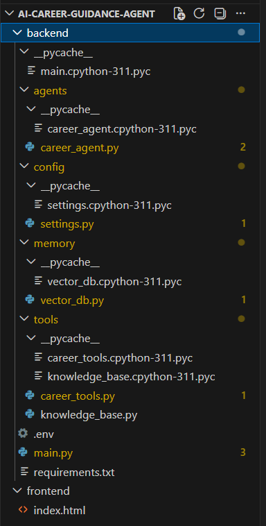

# 🚀 AI Career Guidance Agent

An AI-powered career assistant that provides personalized guidance on courses, skills, career paths, and learning roadmaps using **Google Gemini API, LangChain, and FastAPI**.

---

## 🌟 Features

- 🎯 Personalized career guidance
- 📘 Course information (B.Tech, BCA, etc.)
- 🧠 Skill analysis & recommendations
- 💼 Role suggestions (AI Engineer, Software Developer, etc.)
- 🛠️ Project ideas for students
- 🗺️ Learning roadmap generation
- 💾 Memory-based responses (basic context)
- 💬 ChatGPT-style UI with Dark Mode

---

## 🧠 Tech Stack

| Layer        | Technology |
|-------------|-----------|
| Backend     | FastAPI |
| AI Model    | Google Gemini API |
| Framework   | LangChain |
| Frontend    | HTML, CSS, JavaScript |
| Memory      | In-memory / ChromaDB (optional) |

---

## 📁 Project Structure
```
ai-career-guidance-agent/
│
├── backend/
│ ├── main.py
│ ├── requirements.txt
│ ├── .env
│
│ ├── agents/
│ │ └── career_agent.py
│
│ ├── tools/
│ │ └── career_tools.py
│
│ ├── memory/
│ │ └── vector_db.py
│
│ └── config/
│ └── settings.py
│
├── frontend/
│ └── index.html
│
└── README.md
```
---

## 📸 Demo



---

💡Example Queries

Try these in the chat UI:

- What is B.Tech Computer Science?
- Which course is best after 12th PCM?
- I am a 2nd year CSE student, how to become AI engineer?
- Suggest AI projects for beginners
- Give roadmap for software developer

---

## 📈 Future Improvements
- Chat history sidebar (like ChatGPT)
- Streaming responses (typing animation)
- Voice input support
- Deployment (Render / Railway / Vercel)
- Authentication system
---

## 👨‍💻 Author

**Sumit Sharma**  
B.Tech CSE Student | AI & Machine Learning Enthusiast
